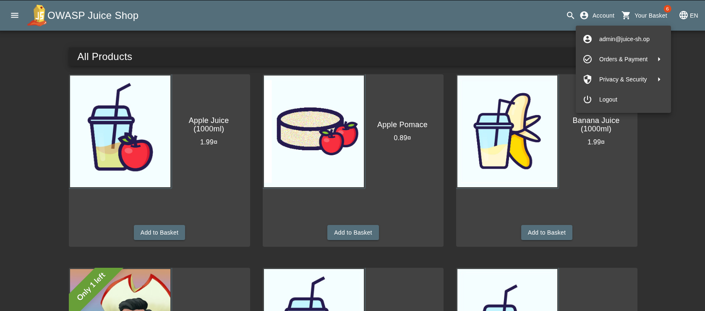
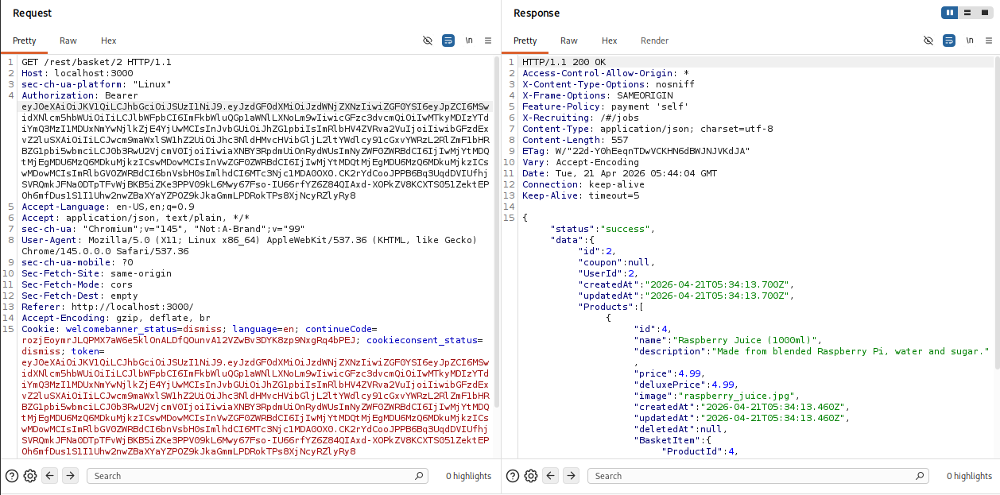
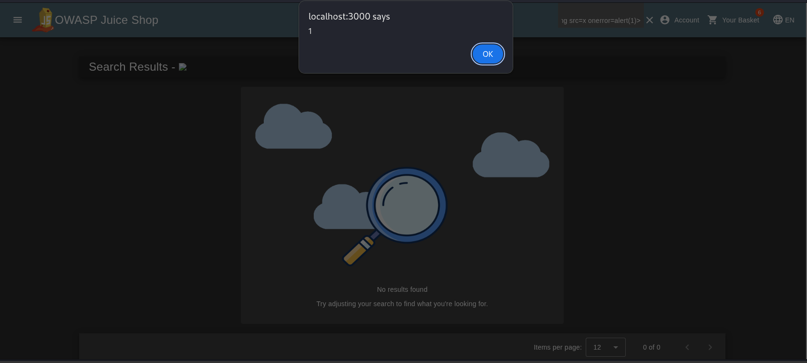

# 🧪 OWASP Juice Shop — Security Assessment

## 📌 Overview

- A structured penetration test was performed on the OWASP Juice Shop to simulate a real-world security assessment.

- The goal was to identify vulnerabilities, validate their impact, and demonstrate realistic attack scenarios.

---

## 🔗 Attack Chain

```text 
SQL Injection → Admin Access → Unauthorized Data Access (IDOR)
```

- An attacker can bypass authentication, gain administrative access, and retrieve sensitive user data.

---

## 🔴 SQL Injection → Authentication Bypass

### Payload

```
admin' OR 1=1--
```

### Proof



### Explanation

- The login endpoint fails to properly sanitize user input, allowing SQL injection to bypass authentication.

### Impact

- An attacker can log in as an administrator without valid credentials, resulting in full system compromise.

---

## 🟠 IDOR → Unauthorized Data Access

### Endpoint

```
GET /rest/basket/2
```

### Proof



### Explanation

- By modifying object IDs, the application returns data belonging to other users without proper authorization checks.

## Impact

- Sensitive user data can be accessed by unauthorized users, leading to privacy violations.

---

## 🟡 XSS → Client-side Execution

### Payload

```

```

### Proof



### Explanation

- User input is not properly sanitized, allowing arbitrary JavaScript execution.

### Impact

- Client-side manipulation is possible. Sensitive cookies are protected, limiting the severity.

---

## 📊 Business Impact

* Unauthorized administrative access without credentials
* Exposure of sensitive user data
* Potential misuse of application functionality

---

## 🛡️ Recommendations

### SQL Injection

* Use parameterized queries
* Validate and sanitize input

### IDOR

* Enforce strict server-side authorization
* Validate ownership of resources

### XSS

* Sanitize user input
* Encode output
* Implement Content Security Policy (CSP)

---

## 🧠 Conclusion

- This assessment demonstrates practical penetration testing skills, including vulnerability discovery, exploitation, validation, and impact analysis in a real-world-like environment.

---
